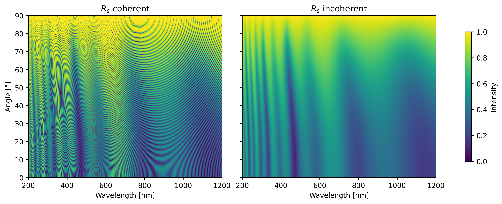

# tmm_faster

`tmm_faster` is a lightweight Python library with a C++ core for very fast calculations of reflection and transmission spectra in optical thin-film systems using the transfer-matrix method (TMM). 

## Features
* **Calculation of reflection and transmission**: Simultaneous calculation of both $s$ and $p$ as well as averaged polarization of isotropic multilayer systems using the transfer-matrix method.
* **Include incoherent layers**: Fully coherent stacks are calculated with `calc_coherent`, stacks containing incoherent layers with `calc_incoherent` (for an example, see [Figure 1](#fig1)).
* **High performance**: C++ core with OpenMP parallelization for rapid calculation of multiple wavelengths and/or incidence angles. Small datasets (<10,000 wavelengths/angles) are up to 70x faster than `tmm_fast`, large datasets are still 1.6x faster (or 3.2x faster for both polarizations), see [Table 1](#tab1).

<div align=center>

<a name="tab1"></a>
|Number of wavelengths|tmm_faster|tmm_fast (CPU)|tmm_fast (CUDA)|
|:---|:---|:---|:---|
|1| 0.02 ms| 2.2 ms (65x) | 7.2 ms (359x)
|10| 0.03 ms| 3.9 ms (71x) | 10.2 ms (296x)
|100| 0.1 ms| 12.8 ms (44x) | 24.5 ms (91x)
|1,000| 0.8 ms | 33.9 ms (29x) | 178.8 ms (191x)
|10,000| 9.4 ms| 18.3 ms (1.6x) | 33.5 ms (2.8x)
|100,000| 76.1 ms | 130.8 ms (1.6x) | 203.2 ms (2.4x)
|1,000,000| 710.9 ms| 1308.6 ms (1.7x) | 1959.3 ms (2.5x)

*Table 1: Runtimes for coherent TMM calculation, 10 layers, random n, k and d, 45° angle 
<br> (on Intel Core i9-13900H, NVIDIA RTX 4000)*

</div>

## Installation

### With pip (Python 3.8+ required)

```bash
pip install tmm_faster
```

### Build from source (C++17 compiler required)
```bash
git clone [https://github.com/clembron/tmm_faster.git](https://github.com/clembron/tmm_faster.git)
cd tmm_faster
python setup.py build_ext --inplace
```

## Get started
See examples/example.py:

```python
import tmm_faster
import numpy as np

wavelengths = np.linspace(200,1200,1000)
d = [np.inf, 5, 500, 5e4, 200, np.inf] 
c = ['i', 'c', 'c', 'i', 'c', 'i']
angles = np.linspace(0,90,1000)

n_list = [1.0, 0.05 + 3.0j, 2.4 + 0.001j, 1.5, 2.4 + 0.001j, 1.0]
n_array = np.array([n_list for _ in wavelengths])

res_incoherent = tmm_faster.calc_incoherent(n_array, d, c, angles, wavelengths)
res_coherent = tmm_faster.calc_coherent(n_array, d, angles, wavelengths)
```

<a name="fig1"></a>

*Figure 1: Reflection spectra (s-polarization) for an example stack with only coherent layers (left) and the same stack but with the thickest layer in the middle being treated as incoherent (right).*

## References

* `tmm` https://github.com/sbyrnes321/tmm
* `tmm_fast` https://github.com/MLResearchAtOSRAM/tmm_fast

## Disclaimer
This project was developed with the assistance of Gemini (Google AI). All physical models and core logic were verified by me.
